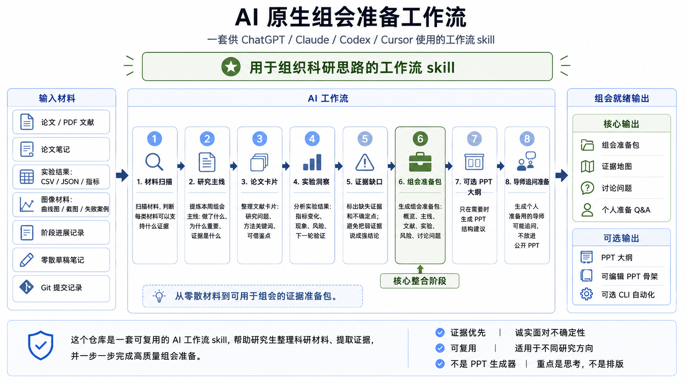

# Grad Meeting Agent

> 一个给 ChatGPT / Claude / Codex / Cursor 使用的 **AI-native 研究生组会准备 workflow skill**。

**AI-native Workflow Skill** · **Research Meeting Pack** · **Not a PPT Generator** · **Optional CLI Automation**



## 🌱 这个项目是什么？

**Grad Meeting Agent 不是一键生成漂亮 PPT 的工具，也不是 CLI-first 项目。**

它是一套可复用的 AI 工作流 skill，帮助研究生把论文、实验结果、图像材料、进度记录、零散笔记和 git commits 整理成组会可用的 **meeting-ready evidence pack**。

组会前最痛苦的往往不是“做 PPT”，而是不知道这一周到底能讲什么、证据在哪里、哪些结论还不能说太满。

所以这个项目更像是“给 AI 的组会准备说明书”：GitHub 仓库负责告诉 AI **怎么整理**，你的研究材料负责提供 **要整理什么**。AI 先按 [skill.md](skill.md) 整理 research thinking，生成 `Research Meeting Pack`；如果后续需要展示材料，再继续生成 `slide outline` 或可编辑 PPT 骨架。

PPT 是 optional presentation layer，核心是 **research thinking organization**。

## ⚡ 一句话调用

如果你只是想快速试用，不需要先安装依赖，也不需要先运行 Python。  
把下面的文字复制给 ChatGPT / Claude / Codex / Cursor，然后提供你的组会材料即可。

### ChatGPT / Claude

适合普通聊天窗口使用。推荐把资料文件夹压缩成 `meeting_materials.zip` 后上传，而不是一个个上传文件。

```text
请把这个 GitHub 仓库当作研究生组会准备 skill 使用：
https://github.com/920961270/Grad_Meeting_Agent

核心 workflow 在这里：
https://github.com/920961270/Grad_Meeting_Agent/blob/main/skill.md

我会上传一个 meeting_materials.zip。请根据 skill.md 的流程读取压缩包里的论文、实验结果、图像和笔记，先生成 Research Meeting Pack。
如果后续需要展示材料，再基于 Meeting Pack 继续生成 slide outline。
```

### Codex / Cursor

适合已经在本地或云端打开项目工作区的用户。请把资料放进当前工作区的 `materials/` 或 `input/` 目录。

```text
请把这个仓库当作 AI-native Research Meeting Skill 使用：
https://github.com/920961270/Grad_Meeting_Agent

请优先遵循：
https://github.com/920961270/Grad_Meeting_Agent/blob/main/AGENTS.md
https://github.com/920961270/Grad_Meeting_Agent/blob/main/skill.md

请扫描当前工作区的 materials/ 目录；如果没有 materials/，再检查 input/。
先生成 Research Meeting Pack。如果后续需要展示材料，再基于 Meeting Pack 生成 slide outline 或可编辑 PPT 骨架。
```

## 📦 材料怎么给 AI？

GitHub 链接只能让 AI 读取这个 skill 的说明和 workflow，比如 README、`skill.md`、`AGENTS.md`、`prompts/` 和 `templates/`。它不能自动读取你电脑里的本地资料文件夹。

用户研究材料需要通过 AI 能访问到的方式提供：

1. ChatGPT / Claude：推荐上传一个 `meeting_materials.zip`。
2. Codex / Cursor：推荐把材料放进当前工作区的 `materials/` 或 `input/`。
3. 如果只有一两个文件，也可以单独上传；但资料多时不推荐一个个传。

推荐 zip 结构：

```text
meeting_materials.zip
├── papers/
├── experiment_results/
├── figures/
├── notes.md
└── progress.md
```

推荐工作区结构：

```text
materials/
├── papers/
├── experiment_results/
├── figures/
├── notes.md
└── progress.md
```

材料用途：

- `papers/`：论文 PDF 或论文摘录
- `experiment_results/`：CSV、JSON、metrics、实验表格
- `figures/`：结果图、对比图、失败案例截图
- `notes.md`：零散想法、老师反馈、实验观察
- `progress.md`：阶段性进展记录

用户不需要一个个上传文件。普通聊天窗口推荐上传 `meeting_materials.zip`；Codex / Cursor 推荐把材料放进当前工作区的 `materials/` 目录。

## 🧭 推荐使用顺序

1. 准备材料：论文、实验结果、图像、笔记、git 进展等。
2. 如果在 ChatGPT / Claude 中使用，把材料打包成 `meeting_materials.zip` 上传。
3. 如果在 Codex / Cursor 中使用，把材料放进当前工作区的 `materials/` 或 `input/`。
4. 让 AI 按 `skill.md` 先生成 `Research Meeting Pack`。
5. 先检查主线、证据链、缺口和讨论问题是否合理。
6. 如果需要组会展示，再继续生成 `slide outline` 或可编辑 PPT 骨架。

这套顺序的重点是：先整理 research thinking，再生成 slides。

## 📝 懒人复制版

不想自己写 prompt 的话，可以直接复制：

- 中文：[prompts/quick_start_zh.md](prompts/quick_start_zh.md)
- English：[prompts/quick_start_en.md](prompts/quick_start_en.md)

理想路径：

- Codex / Cursor 用户：一句话调用 `AGENTS.md + skill.md`
- ChatGPT / Claude 用户：复制 `quick_start_zh.md`，再上传 `meeting_materials.zip`
- 深度用户：按 [prompts/](prompts/) 分步骤使用
- 自动化用户：可选运行 CLI

## ✨ 它能帮你做什么？

- 扫描论文、笔记、实验结果、图像材料、git commits
- 提炼本周组会主线 `Research Thread`
- 生成论文卡片 `Paper Cards`
- 分析实验结果 `Experiment Insights`
- 标出证据缺口 `Evidence Gap`
- 给核心结论标注证据强度 `Claim Strength`
- 用领域视角检查指标冲突 `Domain Lens`
- 生成核心文档 `Research Meeting Pack`
- 给出可选 PPT 大纲 `Slide Outline`
- 准备导师可能追问 `Supervisor Q&A`

## 🧠 为什么不是直接问 ChatGPT？

当然可以直接问 AI：“帮我做组会 PPT。”

但这种问法通常会太泛：AI 可能直接开始写页面标题、堆 bullet，甚至把不确定的实验现象说成确定结论。

这个 repo 提供的是一套稳定、可复用、可检查的 workflow：

1. 先扫描材料，判断有哪些证据。
2. 再提炼本周可以汇报的研究主线。
3. 然后生成论文卡片、实验洞察、风险缺口。
4. 最后再决定哪些内容适合进入展示材料。

也就是说，它不是“另一个 prompt”，而是一套让 AI 更像科研助理一样工作的组会准备流程。

### 🧠 为什么要标注证据强度？

组会里最容易出问题的地方，不是“没有结果”，而是把初步现象讲成了确定结论。

所以这个 skill 会要求 AI 给核心结论标注 `Strong / Moderate / Weak / Insufficient`，并说明：证据来自哪里、有没有反例或冲突、需要人工确认什么、下一步怎么验证。

这样做的目的不是保守到不敢汇报，而是让你更清楚：哪些内容可以重点讲，哪些内容应该作为假设或待验证问题讲。

### 🧩 Domain Lens

不同方向不能用同一套泛泛标准看结果。比如：

- CV / 视频增强：PSNR、SSIM 提升，不一定代表检测稳定性更好。
- Robotics / Control：平均误差下降，也要看中断率、控制延迟和扰动鲁棒性。
- Education / Learning Analytics：学习时长增加，不等于学习效果提升。
- HCI / AI Product：任务时间减少，也要看错误严重度、信任和隐私风险。
- Materials / Engineering：最高强度或硬度，不一定是最佳工艺，还要看延展性、组织结构和重复样本。

对应规则在 [prompts/domain_lenses.md](prompts/domain_lenses.md) 里。材料方向明确时，AI 会先用相应 lens 判断证据；方向不明确时，则使用通用研究证据链。

## 🗂️ 推荐输入材料

你不需要每一项都准备齐。材料不完整时，skill 会保守整理，并标记需要人工确认的点。

- `papers/` 或 PDF papers：论文、方法背景、相关工作
- `paper_notes.md`：中文阅读笔记、方法启发
- `experiment_results/`：CSV / JSON / metrics / tables
- `figures/`：plots / screenshots / before-after / failure cases
- `progress.md`：本周进展记录
- `notes.md`：零散想法、老师反馈、实验观察
- `git commits`：近期代码改动、实验脚本更新

可以参考：[templates/materials_checklist.md](templates/materials_checklist.md)

## 🚀 三种使用方式

### 方式 A：ChatGPT / Claude

最短方式：复制 [prompts/quick_start_zh.md](prompts/quick_start_zh.md)，再上传 `meeting_materials.zip`。它会引导 AI 先生成 `Research Meeting Pack`，后续再按需生成展示材料。

需要更精细控制时，可以分步骤复制：

- [01_material_scan.md](prompts/01_material_scan.md)
- [02_research_thread.md](prompts/02_research_thread.md)
- [03_paper_cards.md](prompts/03_paper_cards.md)
- [04_experiment_insights.md](prompts/04_experiment_insights.md)
- [05_meeting_pack.md](prompts/05_meeting_pack.md)
- [06_slide_outline.md](prompts/06_slide_outline.md)
- [07_supervisor_qa.md](prompts/07_supervisor_qa.md)
- [domain_lenses.md](prompts/domain_lenses.md)

### 方式 B：Codex / Cursor

适合你的材料已经放在项目目录里，希望 AI 直接读取文件并整理。

```text
请按本仓库的 AGENTS.md 和 skill.md，整理 materials/ 里的材料；如果没有 materials/，再检查 input/。先生成 Research Meeting Pack，并标注核心结论的证据强度与 Evidence Map。
如果后续需要展示材料，再基于 Meeting Pack 生成 slide outline 或可编辑 PPT 骨架。
```

推荐材料目录：

```text
materials/
├── papers/
├── experiment_results/
├── figures/
├── notes.md
└── progress.md
```

如果你在 Codex / Cursor 里工作，也可以让它顺手查看最近的 git commits，作为实现进展或实验脚本变化的证据。

### 方式 C：可选本地自动化 CLI

Python CLI 只是 optional automation，不是主入口。适合你想自动生成文件、反复跑 demo、或把流程接入本地材料时使用。

```bash
python main.py --input input --output output --backend rule
```

默认只输出：

```text
output/
├── meeting_pack.md
└── agent_state.json
```

需要展示材料时，可以继续生成 PPT 骨架：

```bash
python main.py --input input --output output --backend rule --with-slides
```

导出拆分明细文件：

```bash
python main.py --input input --output output --backend rule --export-details
```

生成全部内容：

```bash
python main.py --input input --output output --backend rule --all
```

## 📦 输出内容

核心输出：

- `Research Meeting Pack`：组会准备总文档
- `Evidence Map`：材料与证据链
- `Discussion Questions`：适合拿到组会上问导师的问题
- `Personal Prep Q&A`：自己会前准备的导师追问

可选输出：

- `Slide Outline`：PPT 结构建议
- `Editable PPT Skeleton`：可编辑 PPT 骨架
- `Optional CLI Automation`：本地自动生成文件

注意：`Personal Prep Q&A` 是给自己准备回答思路的，不适合直接放到公开 PPT 里。

## 📁 项目结构

```text
Grad_Meeting_Agent/
├── AGENTS.md
├── skill.md
├── prompts/
├── templates/
├── examples/
├── pic/
│   └── figure0.png
├── input/
├── src/
├── main.py
└── README.md
```

- `AGENTS.md`：给 Codex / Cursor / Claude Code 等 AI coding assistant 的项目级指令
- `skill.md`：主 workflow，适合直接复制给 AI
- `prompts/`：分步骤 prompt 和 quick start prompt
- `templates/`：Research Meeting Pack、Evidence Map、材料清单和导师问题库
- `examples/`：示例材料和使用说明
- `pic/`：README 图片
- `src/` 和 `main.py`：可选本地自动化

## 🧩 Workflow

1. `Material Scan`：扫描材料，判断有哪些证据
2. `Research Thread`：提炼本周可汇报主线
3. `Paper Cards`：生成论文卡片
4. `Experiment Insights`：解释实验结果
5. `Evidence Gap`：指出缺口、反例、证据强度和风险
6. `Meeting Pack`：生成组会准备包
7. `Optional Slide Outline`：生成可选 PPT 结构
8. `Supervisor Q&A`：生成个人准备问题

## 🤝 适合谁？

- 每周/月需要开组会的研究生
- 经常读论文但不知道怎么汇报的人
- 有实验结果但不知道怎么组织证据链的人
- 已经会用 ChatGPT / Claude / Codex / Cursor，想要更稳定 workflow 的人
- 想把“零散科研材料”整理成“组会可讲内容”的科研新手

## 🛣️ Roadmap

- [x] AI-native skill workflow
- [x] `AGENTS.md` 一句话调用入口
- [x] `skill.md`
- [x] `prompts/`
- [x] quick start prompts
- [x] meeting pack template
- [x] optional CLI automation
- [x] README workflow diagram
- [x] zip / workspace materials workflow
- [x] Claim Strength / Evidence Map
- [x] Domain Lens prompts
- [ ] 更好的 examples
- [ ] 中文/英文双语模板
- [ ] 更强的 paper grounded extraction
- [ ] figures 图像理解与失败案例整理
- [ ] Streamlit demo，可选

## 📄 License

MIT
